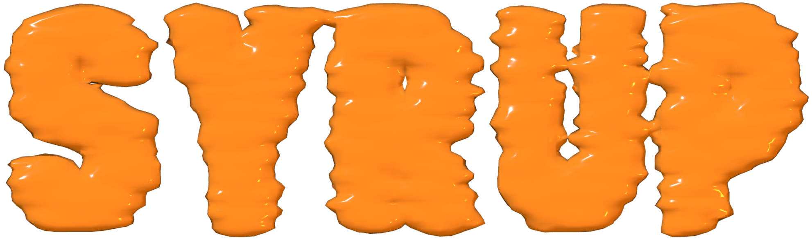

SYRUP is a browser-based phylogenetics app built with Svelte, Vite, TypeScript, and a WebAssembly build of [CMAPLE](https://academic.oup.com/mbe/article/41/7/msae134/7700168). It lets you load alignments, run inference locally in the browser, and inspect the resulting tree in an interactive UI.

## Stack

- Svelte 5 + TypeScript
- `@phylocanvas/phylocanvas.gl` for tree rendering
- CMAPLE compiled to WebAssembly

## Development

### Prerequisites

- Node.js
- npm
- Optional: `pixi` for rebuilding the WASM assets

### Install dependencies

```bash
npm install
```

### Start the app locally

```bash
npm run dev
```

The Vite dev server is configured to send the cross-origin isolation headers required for threaded WASM:

- `Cross-Origin-Opener-Policy: same-origin`
- `Cross-Origin-Embedder-Policy: require-corp`

### Run checks

```bash
npm run check
```

### Build for production

```bash
npm run build
```

### Preview the production build

```bash
npm run preview
```

The Vite preview server also sends the cross-origin isolation headers above.

## WASM development

The WebAssembly artifacts are built via `pixi` and the helper scripts in [scripts](scripts).

### Rebuild the CMAPLE WASM bundle

```bash
npm run build:wasm
```

Equivalent `pixi` command:

```bash
pixi run build-wasm
```

### Available `pixi` tasks

- `pixi run install-binaryen`
- `pixi run build-libomp`
- `pixi run build-wasm`

## GitHub Pages

A deployment workflow is included at [.github/workflows/deploy-pages.yml](.github/workflows/deploy-pages.yml). It:

- runs on pushes to `main`
- installs dependencies with `npm ci`
- builds the site with `npm run build`
- uploads `dist`
- deploys the artifact to GitHub Pages

## Hosting notes

Threaded WASM requires cross-origin isolation headers:

- `Cross-Origin-Opener-Policy: same-origin`
- `Cross-Origin-Embedder-Policy: require-corp`

Local development and `vite preview` provide these headers. If you deploy to another host, that host must also send them for threaded execution to work.

## Project structure

- [src](src) — application source
- [public](public) — static assets copied as-is
- [scripts](scripts) — WASM/toolchain helper scripts
- [wasm](wasm) — CMAPLE WASM source/build inputs
- [vendor/cmaple](vendor/cmaple) — vendored CMAPLE source
- [build](build) — local build artifacts and external toolchain output

## Notes

- The app is fully client-rendered.
- Alignment parsing and inference run locally in the browser.
- The landing page uses a custom interactive Three.js logo.
- The tree viewer uses Phylocanvas GL.
