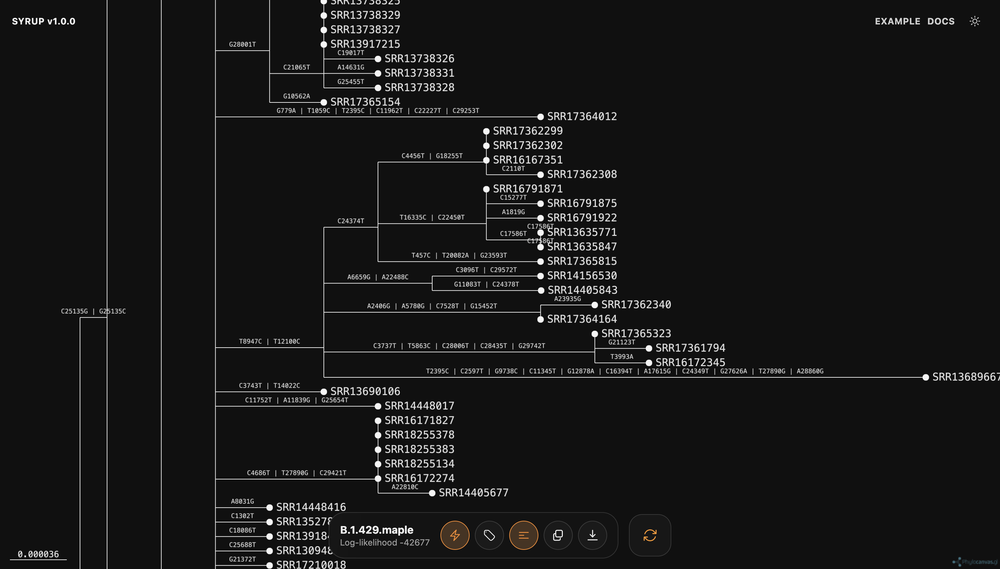

# Outputs

## Tree viewer

After inference, Syrup displays the inferred tree in an interactive viewer. The toolbar shows the input file name and the rounded log-likelihood when available.

The viewer controls can:

- show or hide inferred mutations above their branches when viewing a mutation-annotated tree
- show or hide internal labels
- show or hide leaf labels
- copy the Newick tree
- download the tree
- return to run settings

## Newick tree

For standard runs, Syrup downloads a `.nwk` file. The same Newick text can also be copied to the clipboard.

## Mutation-annotated tree

If **Infer mutations along each branch and output a mutation-annotated tree (MAT)** is enabled, Syrup downloads a `.mat.nex` file when CMAPLE returns NEXUS output.
The interactive viewer displays inferred mutations on both internal and terminal branches. Copied Newick output retains the annotation comments used for these labels.

## MAPLE alignment

The **Download MAPLE format** link exports the loaded alignment in MAPLE format. This is available after preflight completes and before inference starts.
