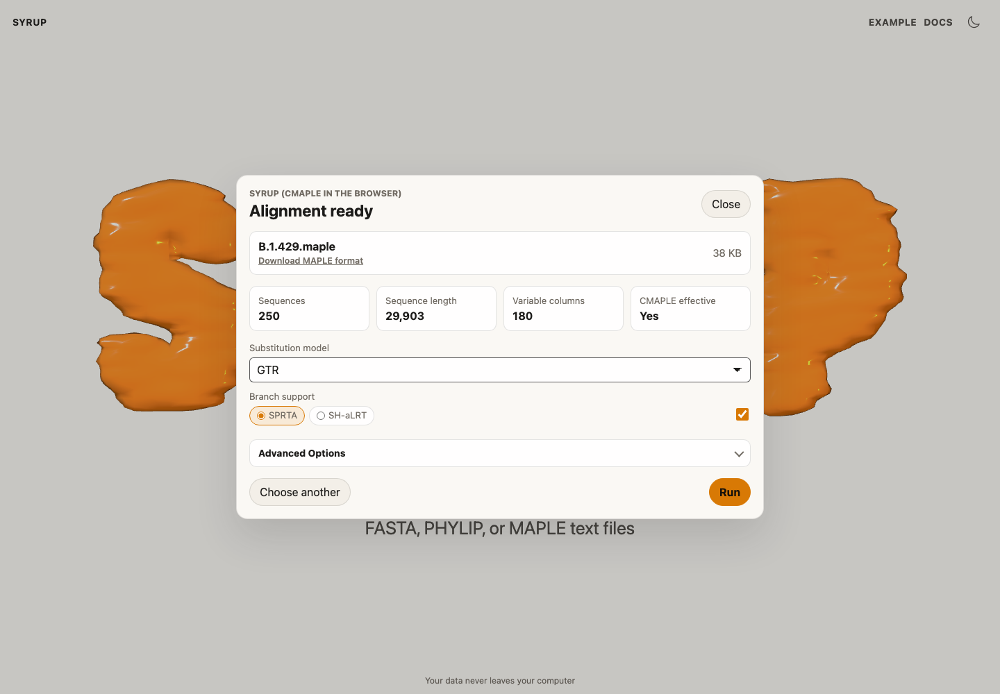
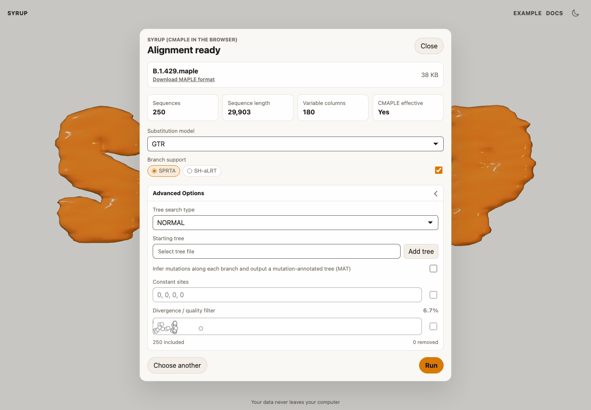
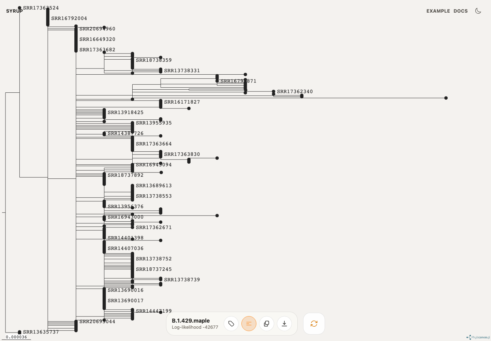

# Usage

Syrup has one main workflow: load an alignment, review the preflight checks, run CMAPLE, and export the result.

## Load an alignment

Drop an alignment file onto the start screen, or select the drop zone and choose a file. Syrup accepts FASTA, PHYLIP, and MAPLE text files.

## Review preflight checks

After loading, Syrup parses the file and reports:

- sequence count;
- sequence length;
- variable columns;
- whether CMAPLE is expected to be effective.

If Syrup reports that the data are probably not suitable for CMAPLE, consider using a more general phylogenetic inference tool.

## Choose run settings

The default settings are intended for a standard CMAPLE run:

- DNA alignments use `GTR` by default.
- Protein alignments use `LG` by default.
- Branch support is enabled with `SPRTA` by default.
- Tree search uses `NORMAL` by default.

Open **Advanced Options** when you need a starting tree, a different tree search mode, constant-site counts, a mutation-annotated tree, or divergence filtering.

## Run inference

Select **Run**. Syrup shows the CMAPLE log while inference is running. Keep the browser tab open until the run finishes.

## View the result

When the run completes, Syrup opens the tree viewer.

Use the toolbar to show or hide labels, copy the Newick tree, download the tree, or return to the run settings.

