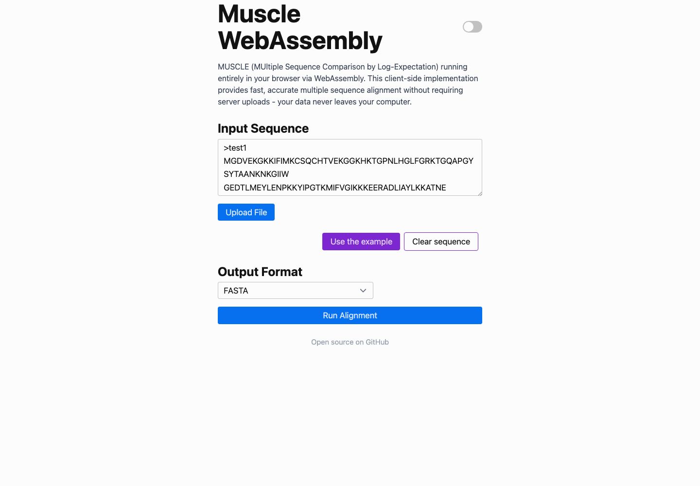
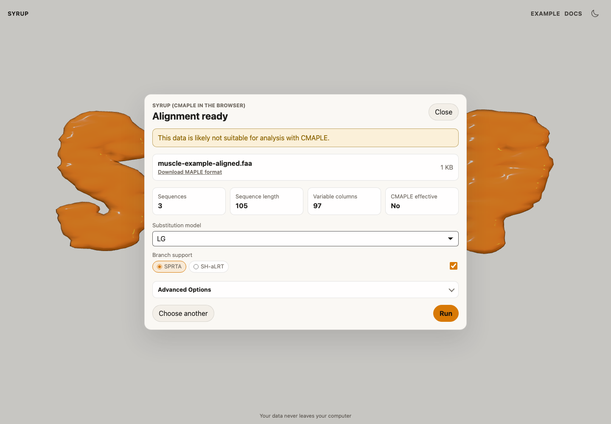
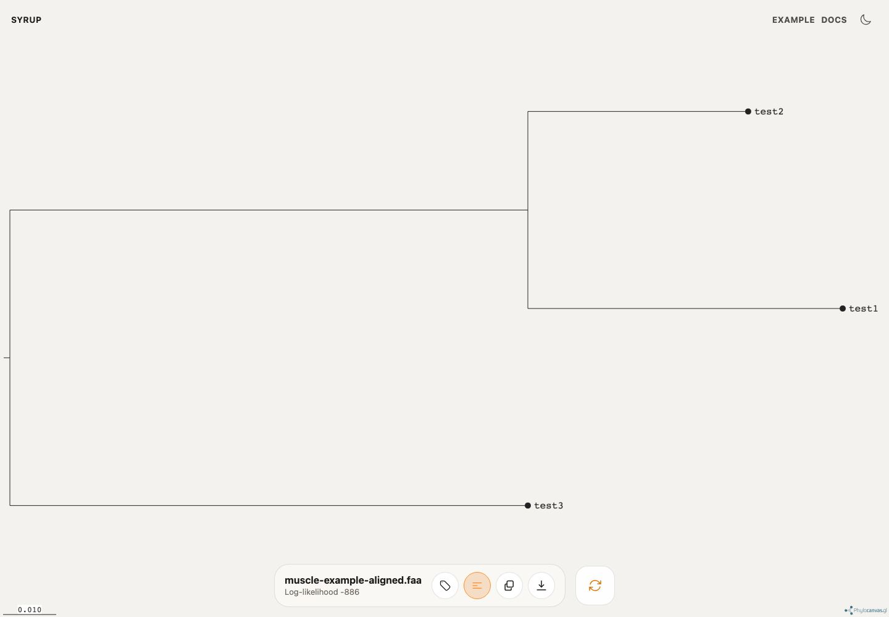

# Amino acid phylogenetics with MUSCLE

Use this workflow when you have unaligned protein sequences and want to build an amino-acid phylogeny entirely in the browser.

## Align proteins with MUSCLE

1. Open the [MUSCLE WebAssembly workflow](https://blog.wytamma.com/embl-ebi-muscle-wasm/).
2. Add your unaligned amino-acid FASTA file, or select **Use the example** to try the browser workflow.
3. Run MUSCLE in the browser.
4. Download the aligned FASTA output.

MUSCLE prepares the multiple sequence alignment. Syrup expects aligned sequences, so do this step before loading the file into Syrup.

## Run Syrup

1. Open Syrup.
2. Add the aligned amino-acid FASTA file from MUSCLE.
3. Check that Syrup detects the sequence type as protein.
4. Choose an amino-acid substitution model. `LG` is the default protein model.
5. Select branch support settings if needed.
6. Select **Run**.

## Export the tree

When the run finishes, inspect the tree in the viewer and download the Newick tree for downstream use.

## Notes

- Syrup does not align sequences. Use MUSCLE or another aligner first.
- CMAPLE is designed for closely related pathogen datasets. Check the preflight suitability result before interpreting the tree.
- For more amino-acid model details, see the [IQ-TREE substitution model documentation](http://www.iqtree.org/doc/Substitution-Models#amino-acid-exchange-rate-matrices).
