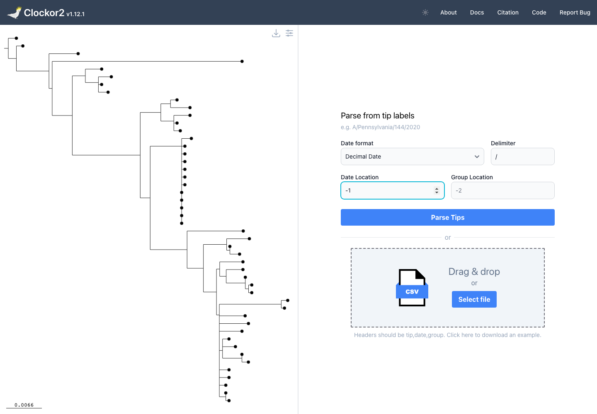
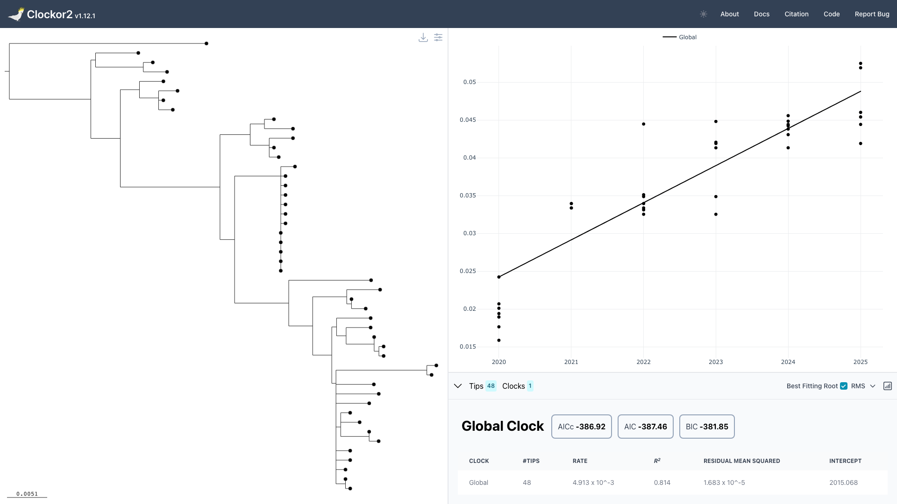

# Molecular clock with Clockor2

[https://clockor2.github.io](https://clockor2.github.io) fits a root-to-tip regression in the browser and can search for the best-fitting root. This workflow follows on from the example of building a pathogen tree from the [Nextclade workflow](pathogen-nextclade.md). 

## Prepare the tree

1. Complete the [Pathogen phylogenetics with Nextclade](pathogen-nextclade.md) workflow.
2. In Syrup, download the inferred Newick tree.
3. Confirm that tip labels contain dates. In the influenza example, tips look like `A/Pennsylvania/144/2020`.

For this example, the date is the final field in the tip label. Split each tip label on `/` and use position `-1`, which gives `2020`, `2021`, and so on.

## Load the tree in Clockor2

1. Open [Clockor2](https://clockor2.github.io/).
2. Add the Newick tree downloaded from Syrup.
3. In **Parse from tip labels**, set:
   - **Date format**: `Decimal Date`
   - **Delimiter**: `/`
   - **Date Location**: `-1`
4. Select **Parse Tips**.

## Fit the best root with RMS

After parsing, Clockor2 shows the root-to-tip regression. Enable **Best Fitting Root** and keep the criterion set to **RMS**.

## Notes

- The `-1` date location means "the last field after splitting on the delimiter".
- If your labels use a different format, change the delimiter and date location accordingly.
- Clockor2 runs locally in the browser; the tree file is not uploaded by the app.

