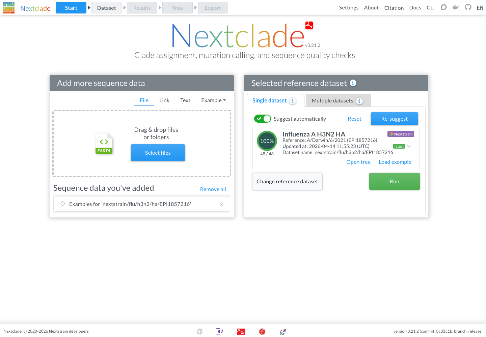
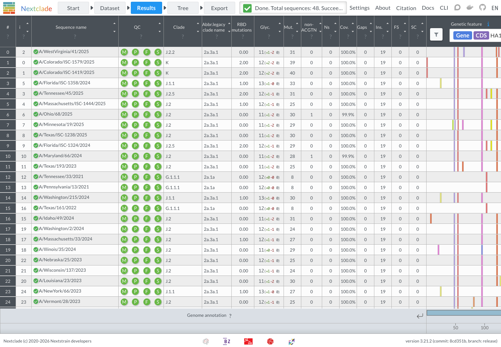
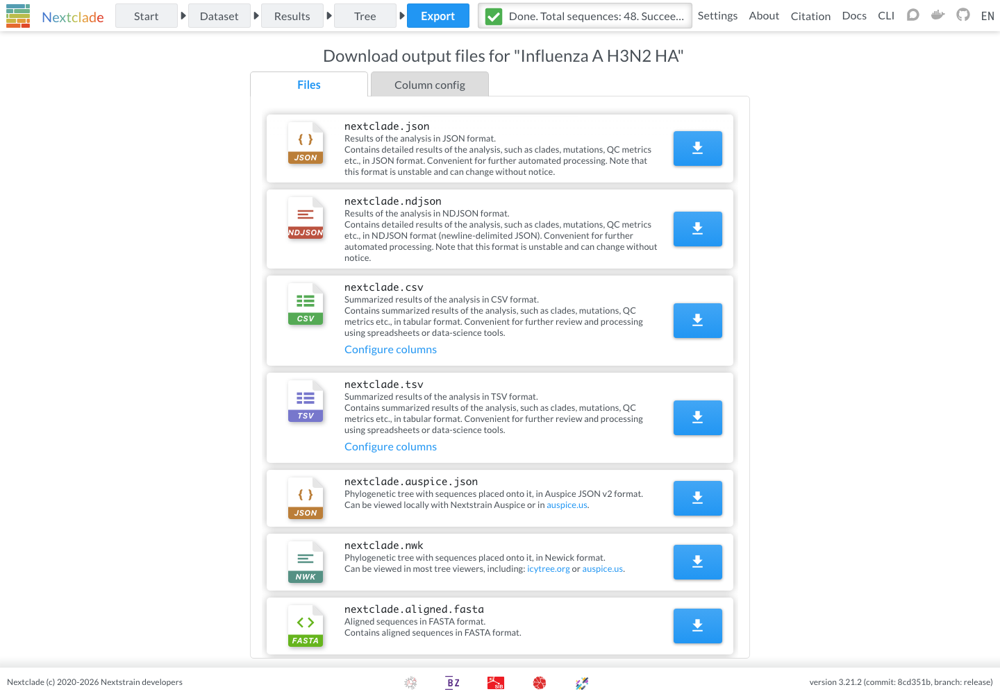
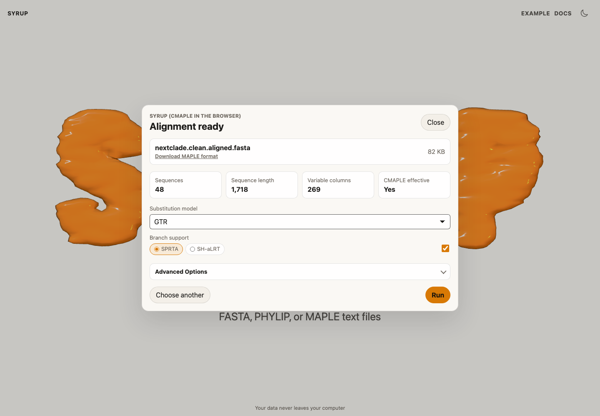
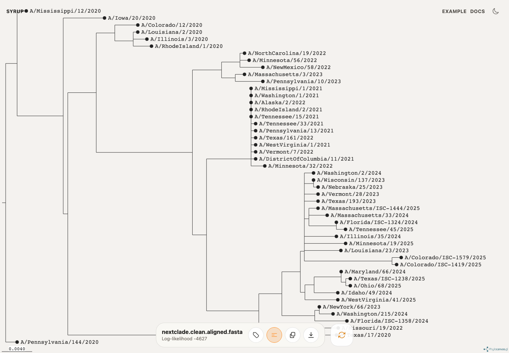

# Pathogen phylogenetics with Nextclade

Use this workflow when you have pathogen sequences that need to be aligned and quality checked before tree inference. Nextclade prepares the aligned FASTA; Syrup builds and visualizes the CMAPLE tree in the browser.

## Run a Nextclade example

1. Open [Nextclade](https://clades.nextstrain.org/).
2. Load an unaligned FASTA file, or select **Use the example** to try the browser workflow. 
3. Choose a reference dataset, such as `nextstrain/flu/h3n2/ha/EPI1857216`.
4. Select **Run**.

Nextclade aligns the sequences, assigns clades, calls mutations, and reports quality-control results.

## Export the aligned FASTA

Open **Export** and download `nextclade.aligned.fasta`.

## Build the tree in Syrup

1. Open Syrup.
2. Add `nextclade.aligned.fasta`.
3. Review the preflight summary.
4. Keep `GTR` for a standard DNA run, or choose another DNA model if needed.
5. Select branch support settings.
6. Select **Run**.

When the run completes, inspect the tree and download the Newick file.

## Notes

- Syrup expects an aligned file. Use `nextclade.aligned.fasta`, not the original unaligned input.
- Nextclade also exports `nextclade.nwk`, which is a placement tree from Nextclade. Use Syrup when you want to infer a CMAPLE tree from the aligned sequences.
- For private data, both Nextclade and Syrup run in the browser; avoid sharing generated links unless the files are intentionally public.

