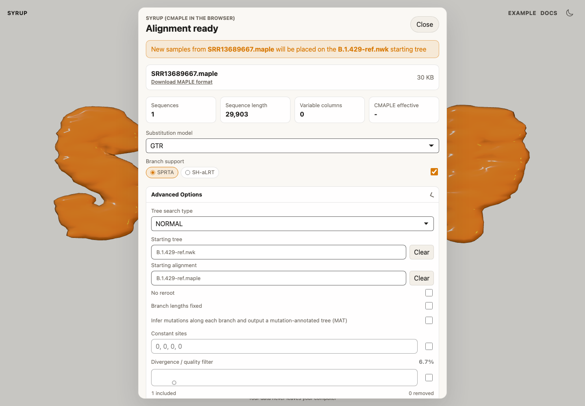
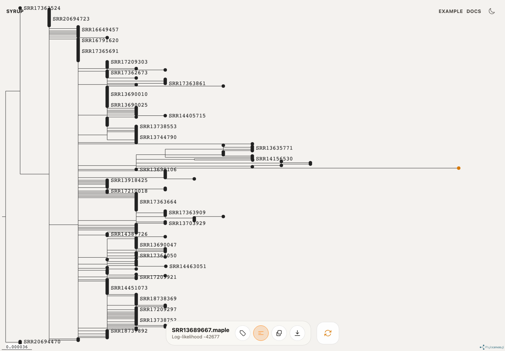

# Phylogenetic placement

Use phylogenetic placement when you already have a reference tree and want to add new samples to it. Click the following link to open Syrup with a [preloaded example placement run](https://syrup.cpg.org.au/?alignment=/samples/SRR13689667.maple&startingTree=/refs/B.1.429-ref.nwk&startingAlignment=/refs/B.1.429-ref.maple).

## Prepare files

You need:

- a new-sample alignment;
- a starting tree in Newick or NEXUS format;
- the starting alignment used with the starting tree, when available.

The new-sample alignment and starting alignment should describe the same genomic coordinates.

## Load the placement run

Open Syrup, add the new-sample alignment, then open **Advanced Options** and add the starting tree. If you have the reference alignment, add it as the starting alignment.

Syrup will show a notice that the new samples will be placed on the selected starting tree.

## Run placement

Keep `NORMAL` tree search for the default placement workflow. Use `FAST` when you only want placement, or `EXHAUSTIVE` when you want CMAPLE to consider a broader search after placement.

Select **Run**. When the run finishes, the placed samples are highlighted in the tree viewer.

Download the resulting tree for downstream analysis or reporting.

